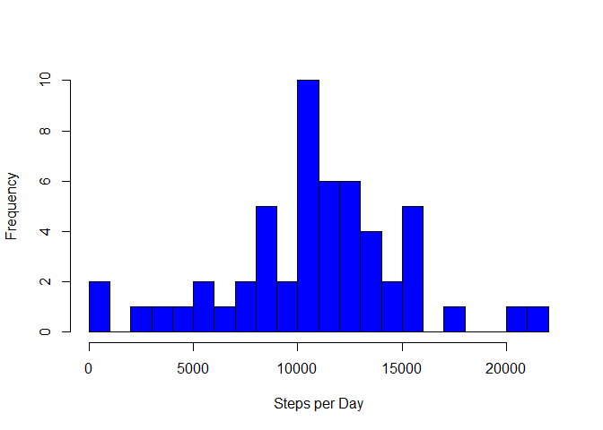

# Reproducible Research: Peer Assessment 1


First we will setup and load the necessary libraries needed to conduct this 
Analysis

```r
library(knitr)
```

```
## Warning: package 'knitr' was built under R version 3.2.2
```

```r
library(ggplot2)
```

```
## Warning: package 'ggplot2' was built under R version 3.2.2
```

```r
library(lattice)
opts_chunk$set(echo= TRUE)
```

## Loading and preprocessing the data
The next step is to load in the data, look at it to get a sense of what it
looks like, and preprocess the data so that is useful

```r
activity <- read.csv("activity.csv")
summary(activity)
```

```
##      steps                date          interval     
##  Min.   :  0.00   2012-10-01:  288   Min.   :   0.0  
##  1st Qu.:  0.00   2012-10-02:  288   1st Qu.: 588.8  
##  Median :  0.00   2012-10-03:  288   Median :1177.5  
##  Mean   : 37.38   2012-10-04:  288   Mean   :1177.5  
##  3rd Qu.: 12.00   2012-10-05:  288   3rd Qu.:1766.2  
##  Max.   :806.00   2012-10-06:  288   Max.   :2355.0  
##  NA's   :2304     (Other)   :15840
```

```r
activity$date <- as.Date(activity$date)
activity_sub <- na.exclude(activity)
```
In this case, we turned the interval into a factor and converted the dates into date class. We also created a subsetted database with the NA's removed.

## What is mean total number of steps taken per day?
To address this questions ignoring the NAs, we will use the subsetted data to
ge the total number of steps per day. First we will make a new data set compsoed of days and total steps per day

```r
steps_per_day <- sapply(split(activity_sub$steps, activity_sub$date), sum)
steps_per_day <- as.data.frame(steps_per_day)
steps_per_day[,2] <- as.factor(rownames(steps_per_day))
rownames(steps_per_day) <- NULL
names(steps_per_day) <- c("Steps", "Day")
summary(steps_per_day)
```

```
##      Steps               Day    
##  Min.   :   41   2012-10-02: 1  
##  1st Qu.: 8841   2012-10-03: 1  
##  Median :10765   2012-10-04: 1  
##  Mean   :10766   2012-10-05: 1  
##  3rd Qu.:13294   2012-10-06: 1  
##  Max.   :21194   2012-10-07: 1  
##                  (Other)   :47
```

We can see from above that the total steps per day ranges from 41 to 21194 with a median of 10765 and a mean of   
1.0766\times 10^{4}.

We can visualize this data by generating a histogram and we see that the total number of steps in around 10,000

```r
hist(steps_per_day$Steps, breaks = 20, xlab = "Steps per Day", col = "blue", main = NULL)
```

 

## What is the average daily activity pattern?
To exmaine the data and compare the average steps per interval through the day, we will first summarize the steps by interval for all days. 


```r
steps_per_interval <- sapply(split(activity_sub$steps, activity_sub$interval), mean)
steps_per_interval <- as.data.frame(steps_per_interval)
steps_per_interval[,2] <- unique(activity_sub$interval)
rownames(steps_per_interval) <- NULL
names(steps_per_interval) <- c("Steps", "Interval")
```

Then we can make a time series plot to visualize this data

```r
g <- ggplot(data = steps_per_interval, aes( x =Interval, y = Steps)) + geom_line()
g
```

 

Then we can look at the data quantitatively 

```r
summary(steps_per_interval)
```

```
##      Steps            Interval     
##  Min.   :  0.000   Min.   :   0.0  
##  1st Qu.:  2.486   1st Qu.: 588.8  
##  Median : 34.113   Median :1177.5  
##  Mean   : 37.383   Mean   :1177.5  
##  3rd Qu.: 52.835   3rd Qu.:1766.2  
##  Max.   :206.170   Max.   :2355.0
```

```r
steps_max <- steps_per_interval$Interval[steps_per_interval$Steps == max(steps_per_interval$Steps)]
```
and determine that the time interval during the day that the most steps are taken is 835


## Inputing missing values
However, we removed a large amount of NA values. We can also look at the data
making asusmptions about the missing values. We can calculate the number of NA values using the following R code: 

```r
list_NA <- is.na(activity$steps)
num_NAs <- length(list_NA[list_NA == TRUE])
```

The number of NAs in the dataset are 2304

To address these missing values, we will use the mean of the steps taken for 
that interval across all days to replace the NA values. The code for this is 

```r
sub_NA <- activity[list_NA, ]
for (i in 1:nrow(sub_NA)){
    i_int <- sub_NA[i, 3]
    sub_NA[i, 1] <- steps_per_interval$Steps[steps_per_interval$Interval == i_int]
}
activity_NAs <- rbind(activity_sub, sub_NA)
```
To exmaine how handling the NAs this way impacted our data, we will rerun our analysis of the total steps per day with the new data set.


```r
steps_per_day_NA <- sapply(split(activity_NAs$steps, activity_NAs$date), sum)
steps_per_day_NA <- as.data.frame(steps_per_day_NA)
steps_per_day_NA[,2] <- as.factor(rownames(steps_per_day_NA))
rownames(steps_per_day_NA) <- NULL
names(steps_per_day_NA) <- c("Steps", "Day")
summary(steps_per_day_NA)
```

```
##      Steps               Day    
##  Min.   :   41   2012-10-01: 1  
##  1st Qu.: 9819   2012-10-02: 1  
##  Median :10766   2012-10-03: 1  
##  Mean   :10766   2012-10-04: 1  
##  3rd Qu.:12811   2012-10-05: 1  
##  Max.   :21194   2012-10-06: 1  
##                  (Other)   :55
```
we can compare this to the data without NAs

```r
summary(steps_per_day)
```

```
##      Steps               Day    
##  Min.   :   41   2012-10-02: 1  
##  1st Qu.: 8841   2012-10-03: 1  
##  Median :10765   2012-10-04: 1  
##  Mean   :10766   2012-10-05: 1  
##  3rd Qu.:13294   2012-10-06: 1  
##  Max.   :21194   2012-10-07: 1  
##                  (Other)   :47
```

We can also visualize the data wiht NAs through a histogram plot

```r
hist(steps_per_day_NA$Steps, breaks = 20, xlab = "Steps per Day", col = "blue", main = NULL)
```

 

As we can see, replacing instead of removing the NAs doesn't change the mean, median, min, or max, but does have an impact on the data in between (1st and 3rd quantiles).

## Are there differences in activity patterns between weekdays and weekends?
next we will look at differences in activity between weekdays and weekends. First we need ot transform our steps_per interval dataset to include a column that lets us know whether it was a weekday or weekend

```r
activity_NAs$dow <- weekdays(activity_NAs$date)
for(i in 1:nrow(activity_NAs)){
    if(activity_NAs[i, "dow"] == "Monday" | activity_NAs[i, "dow"] == "Tuesday" |
       activity_NAs[i, "dow"] == "Wednesday" | activity_NAs[i, "dow"] == 
       "Thursday"| activity_NAs[i, "dow"] == "Friday"){
       activity_NAs[i, "type"] <- "Weekday" 
    }    
    
    else activity_NAs[i, "type"] <- "Weekend" 
}
activity_NAs$type <- as.factor(activity_NAs$type)
```
Then well get the mean for each time interval for weekdays and weekends

```r
steps_per_interval_weekday <- with (activity_NAs[activity_NAs$type == "Weekday", ], sapply(split(steps, interval), mean))
steps_per_interval_weekday <- as.data.frame(steps_per_interval_weekday)
steps_per_interval_weekday[,2] <- unique(activity_sub$interval)
rownames(steps_per_interval_weekday) <- NULL
steps_per_interval_weekday$type <- "Weekday"
names(steps_per_interval_weekday) <- c("Steps", "Interval", "Type")
steps_per_interval_weekend <- with (activity_NAs[activity_NAs$type == "Weekend", ], sapply(split(steps, interval), mean))
steps_per_interval_weekend <- as.data.frame(steps_per_interval_weekend)
steps_per_interval_weekend[,2] <- unique(activity_sub$interval)
rownames(steps_per_interval_weekend) <- NULL
steps_per_interval_weekend$type <- "Weekend"
names(steps_per_interval_weekend) <- c("Steps", "Interval", "Type")
Combined_steps <- rbind(steps_per_interval_weekend, steps_per_interval_weekday)
Combined_steps$Type <- as.factor(Combined_steps$Type)
```

Now we can compare this data visually

```r
xyplot(Steps~Interval | Type, data =Combined_steps, xlab = "Intervals", ylab = "Steps", type ="l", layout = c(1,2))
```

 
Looking at the graph we see that people seem to be much more active on the weekend (i.e. take more steps) comapred to weekdays. 
